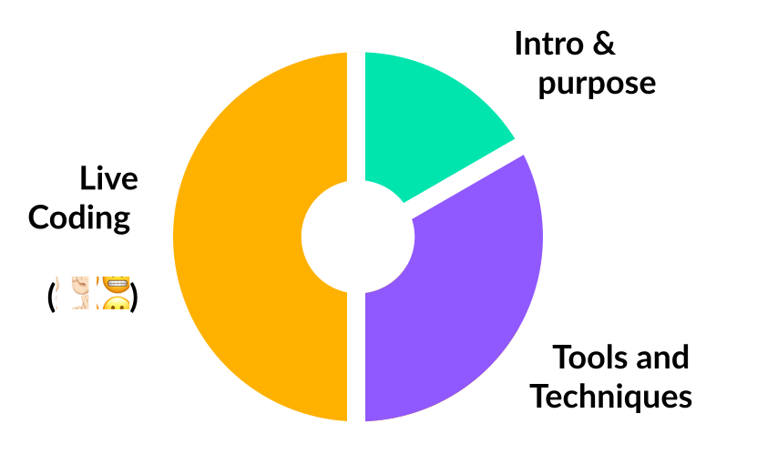

import { Head, Image } from 'mdx-deck';
import { CodeSurfer } from 'mdx-deck-code-surfer';

export { default as theme } from './presentation-theme';

import Triggerable from './src/components/Triggerable';
import BookAnimation from './src/components/BookAnimation';

<Head>
  <title>Whimsical Web Animations</title>
</Head>

# Whimsical Web Animations

---

---

### A word on formatting...

---

## Part 1: Introduction

---

So, we have this awesome new illustration style...

---

---

---

---

---

This new style is part of an effort to make our product more fun.

---

What if they were ✨ animated ✨?

---

I really like doing this kind of work.

---

---

<video
  controls
  loop
  src="presentation-assets/dumbledore.mp4"
  style={{
    width: '100%',
    margin: 'auto',
  }}
/>

---

<video
  controls
  loop
  src="presentation-assets/mail.mp4"
  style={{
    width: '100%',
    margin: 'auto',
  }}
/>
---

<video
  controls
  loop
  src="presentation-assets/guppy.mp4"
  style={{
    width: '100%',
    margin: 'auto',
  }}
/>

---

---

## Wouldn't it be great if our product had whimsical touches like this?

---

---

<Triggerable>
  <BookAnimation />
</Triggerable>

---

## Part II: Tools

---

### CSS Transitions

---

import { Value } from 'react-powerplug'
import Button from '@khanacademy/wonder-blocks-button';

import ProgressBar from './src/components/Demo/ProgressBar';

<Value initial={0.5}>
  {({ value, set }) => (
    <React.Fragment>
      <ProgressBar
        width={300}
        height={15}
        value={value}
      />
       
      <Button onClick={() => set(Math.random())}>
        Set Random Value
      </Button>
    </React.Fragment>
  )}
</Value>

---

<CodeSurfer
  title="CSS transition component"
  code={require('!raw-loader!./src/components/Demo/ProgressBar_width.js')}
  lang="js"
  showNumbers={true}
  dark={false}
  steps={[
    {},
    { range: [5, 9] },
    { range: [10, 13], lines: [21] },
    { range: [14, 20] },
    { range: [24, 29] },
    { range: [30, 33] },
  ]}
/>
---

# 🙅🏼‍♀️

width is <strong>expensive</strong> to recompute on every frame

---

<CodeSurfer
  title="Optimized version"
  code={require('!raw-loader!./src/components/Demo/ProgressBar.js')}
  lang="js"
  showNumbers={true}
  dark={false}
  steps={[
    {},
    { range: [5, 9] },
    { range: [10, 13], lines: [22] },
    { range: [14, 21] },
    { lines: [19] },
    { range: [31, 36] }
  ]}
/>

---

<Value initial={0.5}>
  {({ value, set }) => (
    <React.Fragment>
      <ProgressBar
        width={300}
        height={15}
        value={value}
      />
       
      <Button onClick={() => set(Math.random())}>
        Set Random Value
      </Button>
    </React.Fragment>
  )}
</Value>

---

<a href="https://css-tricks.com/almanac/properties/t/transform/" target="_blank">
  More about Transforms
</a>

---

import ProgressBarKeyframes from './src/components/Demo/ProgressBar.keyframes';

<Value initial={0.5}>
  {({ value, set }) => (
    <Triggerable
      otherActions={
        <React.Fragment>
          

          <Button onClick={() => set(Math.random())}>
            Set Random Value
          </Button>
        </React.Fragment>
      }
    >
      <ProgressBarKeyframes
        width={300}
        height={15}
        value={value}
      />
    </Triggerable>
  )}
</Value>

---

### CSS Animations

---

<CodeSurfer
  code={require('!raw-loader!./code-samples/css-animation.css')}
  lang="css"
  showNumbers={true}
  dark={false}
  steps={[{}, { range: [1, 8] }, { range: [10, 14] }, { lines: [1, 11] }, {range: [12, 13]}]}
/>

---

<CodeSurfer
  code={require('!raw-loader!./code-samples/aphrodite-animation.js')}
  lang="js"
  showNumbers={true}
  dark={false}
  steps={[{}, { range: [1, 4] }, { range: [6, 12] }, ]}
/>
---

<CodeSurfer
  title="CSS animation component"
  code={require('!raw-loader!./src/components/Demo/FadeInComponent.js')}
  lang="js"
  showNumbers={true}
  dark={false}
  steps={[{}, { range: [4, 5] }, {range: [5, 10]}, { range: [11] }, { range: [15, 18] }, { range: [20, 25] }]}
/>

---

<CodeSurfer
  title="In use"
  code={require('!raw-loader!./src/components/Demo/FadeInComponentInUse.js')}
  lang="js"
  showNumbers={true}
  dark={false}
  steps={[{ range: [1, 3] }]}
/>

---

### What if we want to fade out as well?
